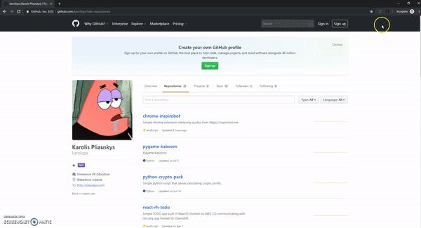

# Simple Task Management chrome extension. HTML, CSS & jQuery.

---

**Getting Started with Google Extensions:** https://developer.chrome.com/extensions/getstarted

## Usage
- Clone this repository.
- Open `chrome://extensions` in your chrome browser.
- In top-right corner of the screen - enable `Developer mode`.
- In top-left corner of the screen - click on `Load unpacked`.
- Navigate to the cloned folder from step #1 and select it.
- You should now see a new icon in your browser's extensions' bar. You can manage your tasks by clicking on the icon anytime you need to do anything with them.